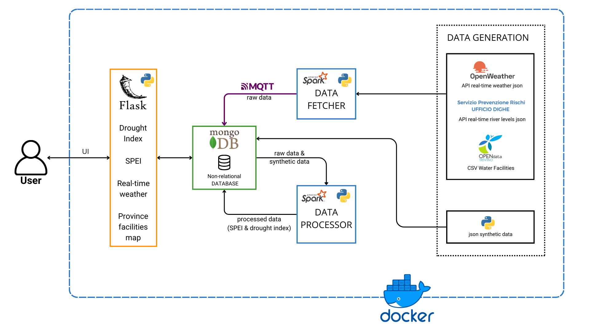

# Water Resource Management Platform

This project aims to design a comprehensive platform for managing water resources and the facilities processing water bodies in the Trentino region. The system collects data from various sources, providing users with real-time weather updates for their city, the monthly drought index, and the annual SPEI (Standardized Precipitation-Evapotranspiration Index). It also features a map showcasing water facilities and dams within the region, along with their real-time water levels.
Project Structure
- data: Data storage
- data fetcher: Scripts for fetching real-time data
- scripts: Data processing scripts
- Spark_app: Apache Spark models for computing drought indexes
- Interface: User Interface and Flask server

## Technologies Used

- Apache Spark: Used for distributed processing of real-time data streams to calculate the SPEI index and perform drought analysis​
- MongoDB: Acts as the primary NoSQL database to store raw and processed weather data​
- Docker & Docker Compose: Facilitates containerization and orchestration of services, ensuring consistent deployment across environments​
- Flask (Python Framework): Powers the web-based User Interface for interactive data visualization​
- PySpark: Provides a Python interface for Apache Spark, enabling large-scale data analysis​
- Climate-Indices Library: Computes drought indices using methods like Thornthwaite PET and SPEI calculations​
- Matplotlib & Pandas: Used for data analysis and visualization within the Flask app​
- Python Scheduling & Requests Libraries: Automates regular data fetching and processing tasks​




## Project Structure
```
.
├── Interface
│   ├── Dockerfile
│   ├── flask_ui.py
│   ├── requirements.txt
│   ├── TRENTO_PROVINCIA.json
│   ├── static
│   │   └── ..
│   ├── templates
│   │   └── ..
│   └── ..
├── data_management
│   ├── Dockerfile
│   ├── fetch_insert_data_MDB.py
│   ├── fetch_insert_facilitesdata_MDB.py
│   ├── fetch_weather_data.py
│   ├── mqtt_river_fetcher.ipynb
│   ├── mqtt_river_fetcher.py
│   ├── requirements.txt
│   └──  synthetic_weather_data.py
├── data
│   ├── rivers
│   │   └── ..
│   ├── cod_com.csv
│   ├── index_of_sensors.csv
│   ├── water_facilities_trentino.csv
│   ├── weather_data.json
│   └── ..
├── spark_app
│   └── ...
├── docker-compose.yml
├── start.sh
└── README.md
 ```


## Setup and Configuration
### API key setup
In order to be able to access realtime weather data it is important to have an API key. You can get one from this website https://openweathermap.org/ , if you are the Professor of BDT you can use the one we sent by email with the project paper.
The key should be saved in your environment as `YOUR_API_KEY`, you can do it like this:
 ```
export YOUR_API_KEY="your_actual_api_key"  # Linux/MacOS
set YOUR_API_KEY="your_actual_api_key" 	# Windows
 ```
Ensure it is correctly set up before running the application.


### Docker Setup
The project uses Docker Compose to manage and run services. You should install it from the terminal if you are using Mac or linux or install the program from the official website if you are working from Windows.

## How to Run
After cloning this repository on your machine, install Docker and follows these steps:

### Clean the environment:

 ```
docker-compose down --remove-orphans
 ```    

### Start Docker:

 ```
docker-compose up --build
 ```

### Access the user interface at http://127.0.0.1:5001.

## Components Description
[...]
